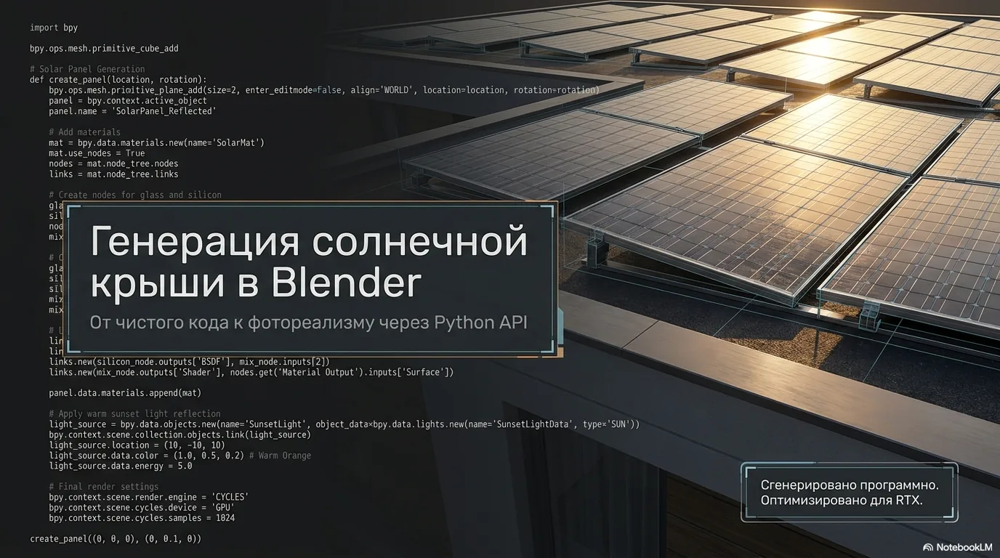

# Solaris: Программная интеграция и визуализация солнечной кровли

🌐 **Живое демо:** [alevoldon.github.io/solar-roof](https://alevoldon.github.io/solar-roof/)



Интерактивная 3D-презентация и автоматизированная визуализация плоской бетонной крыши с оптимизированной сеткой солнечных панелей.

Проект разработан программно с использованием Python API для Blender, анимирован для демонстрации клиенту и оформлен в виде премиального веб-лендинга.

📄 **Техническая документация (EN):** [project_documentation.md](project_documentation.md)

---

## 📋 Описание проекта

Проект демонстрирует концепцию размещения фотоэлектрических систем на плоской кровле здания:

* **Бетонная плита крыши**: 9.66м x 6.23м x 0.3м (общая площадь ~60.18 м², периметр ~31.78м).
* **Сетка солнечных панелей**: 15 кремниевых панелей размером 1.70м x 1.00м x 0.04м в конфигурации 5x3.
* **Ориентация**: Угол наклона 15 градусов с направлением строго на Юг для максимальной энергоэффективности.
* **Материалы**: Процедурные PBR-материалы (матовый бетон, анодированный алюминий, оцинкованная сталь и кремниевые ячейки с токопроводящей сеткой).

---

## ⚡ Особенности и функционал

### 1. Автоматическое 3D-моделирование и анимация (`generate_solar_roof.py`)

Скрипт на Python полностью воссоздает сцену в Blender «с нуля» и настраивает 12-секундную (360 кадров при 30 FPS) анимацию из трёх этапов:

1. **Кадры 1–20 (Плита крыши):** Плавное масштабирование бетонной плиты.
2. **Кадры 20–110 (Сборка панелей):** Последовательное появление панелей снизу вверх, слева направо.
3. **Кадры 120–240 (Облёт камеры):** Круговой облёт на 360° вокруг центра крыши.
4. **Кадры 240–360 (Движение солнца):** Анализ теней от рассвета до заката.

### 2. Оптимизация рендеринга (GPU / Cycles)

Скрипт автоматически настраивает Cycles и активирует совместимые GPU:

* **OptiX / CUDA / HIP / Metal** — выбирается лучший доступный бэкенд.
* Адаптивное сэмплирование (порог шума **0.05**, лимит **256 сэмплов**).
* Шумоподавление **OpenImageDenoise**.
* Процедурное небо (Nishita) для окружающего освещения.

### 3. Интерактивный клиентский лендинг (`index.html`)

Сайт-презентация без тяжёлых фреймворков (HTML / CSS / JS):

* **Интерактивный плеер:** Перемотка по этапам анимации.
* **Карусель слайдов:** 12 слайдов с клавиатурной навигацией.
* **Адаптивность:** Бургер-меню, поддержка `prefers-reduced-motion`.
* **SEO:** Open Graph, favicon, ссылки на PDF/PPTX и GitHub.

---

## 📂 Структура файлов

```text
solar_roof/
├── generate_solar_roof.py              # Python-скрипт генерации сцены в Blender
├── solar_roof.blend                    # Файл проекта Blender
├── index.html                          # Интерактивный лендинг
├── style.css                           # Стили и адаптивность
├── script.js                           # Логика плеера, карусели и меню
├── favicon.svg                         # Иконка сайта
├── project_documentation.md            # Техническая документация (EN)
├── LICENSE                             # MIT License
├── Programmatic_Solar_Photorealism.pptx
├── Programmatic_Solar_Photorealism.pdf
├── slides/                             # Слайды (PNG + WebP)
└── render/
    └── solar_roof_0001-0360.mp4       # Отрендеренная анимация
```

---

## 🚀 Инструкция по запуску

### Запуск генерации в Blender

1. Откройте Blender 4.x / 5.x.
2. Перейдите на вкладку **Scripting** и откройте `generate_solar_roof.py`.
3. Нажмите **Run Script** или выполните в терминале:

   ```bash
   blender --background --python generate_solar_roof.py
   ```

4. Нажмите **Пробел** на таймлайне для воспроизведения анимации.
5. Для рендера анимации: **Render → Render Animation** (`Ctrl + F12`).

### Просмотр лендинга локально

Откройте `index.html` в браузере или используйте любой статический сервер.

### Онлайн-демо

Сайт уже опубликован на GitHub Pages:

**https://alevoldon.github.io/solar-roof/**

---

## 📦 Размер репозитория

Репозиторий содержит медиафайлы (видео ~6.5 МБ, PDF ~12 МБ, PPTX ~14 МБ, слайды). Для продакшн-деплоя рекомендуется хранить тяжёлые бинарники в [GitHub Releases](https://github.com/ALEVOLDON/solar-roof/releases) и подключать Git LFS при дальнейшем росте проекта.

---

## 📜 Лицензия

Проект распространяется под лицензией [MIT](LICENSE).